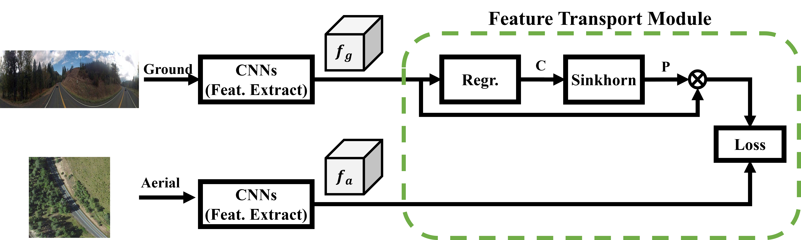

# Optimal Feature Transport for Cross-View Image Geo-Localization

This contains the codes for cross-view geo-localization method described in: Optimal Feature Transport for Cross-View Image Geo-Localization, AAAI2020. 

# Abstract
This paper addresses the problem of cross-view image geo-localization, where the geographic location of a ground-level street-view query image is estimated by matching it against a large scale aerial map (e.g., a high-resolution satellite image). State-of-the-art deep-learning based methods tackle this problem as deep metric learning which aims to learn global feature representations of the scene seen by the two different views.  Despite promising results are obtained by such deep metric learning methods, they, however, fail to exploit a crucial cue relevant for localization, namely, the spatial layout of local features.  Moreover, little attention is paid to the obvious domain gap (between aerial view and ground view) in the context of cross-view localization. This paper proposes a novel Cross-View Feature Transport (CVFT) technique to explicitly establish cross-view domain transfer that facilitates feature alignment between ground and aerial images. Specifically, we implement the CVFT as network layers, which transports features from one domain to the other, leading to more meaningful feature similarity comparison. Our model is differentiable and can be learned end-to-end. Experiments on large-scale datasets have demonstrated that our method has remarkably boosted the state-of-the-art cross-view localization performance, e.g., on the CVUSA dataset, with significant improvements for top-1 recall from 40.79% to 61.43%, and for top-10 from 76.36%  to 90.49%.  We expect the key insight of the paper (i.e., explicitly handling domain difference via domain transport) will prove to be useful for other similar problems in computer vision as well. 

### Experiment Dataset
We use two existing dataset to do the experiments

- CVUSA datset: a dataset in America, with pairs of ground-level images and satellite images. All ground-level images are panoramic images.  
	The dataset can be accessed from https://github.com/viibridges/crossnet

- CVACT dataset: a dataset in Australia, with pairs of ground-level images and satellite images. All ground-level images are panoramic images.  
	The dataset can be accessed from https://github.com/Liumouliu/OriCNN

### Dataset Preparation
Please Download the two datasets from above links, and then put them under the director "Data/". The structure of the director "Data/" should be:
"Data/CVUSA/
 Data/ANU_data_small/"

### Models:
Our trained models for CVUSA and CVACT are available in [here](https://drive.google.com/file/d/1c_T8vkUY72EoqR7vzzm6wXBSfC9r3SBG/view?usp=sharing). 

There is also an "Initialize" model for your own training step. The VGG16 part in the "Initialize_model" model is initialised by the online model and other parts are initialised randomly. 

Please put them under the director of "Model/" and then you can use them for training or evaluation.

### Codes

1. Training:
	CVUSA: python train_cvusa.py
	CVACT: python train_cvact.py

2. Evaluation:
	CVUSA: python test_cvusa.py
	CVACT: python test_cvact.py

### Results
The recall accuracy

|           |  top-1  |   top-5  |  top-10  |  top-1%  |
| --------- | :-----: | :------: | :------: | :------: |
| CVUSA     |  61.43% |   84.69% |   90.49% |   99.02% |
| CVACT_val |  61.05% |   81.33% |   86.52% |   95.93% |

We put the complete recall at top K in [here](https://drive.google.com/file/d/1EZ_J8FJfcqMPWPc3bfXvcozrUZlmr7Dy/view?usp=sharing) in case you want to directly compare with them. 

### Publications
This work is published in AAAI 2020.  
[Optimal Feature Transport for Cross-View Image Geo-Localization](https://arxiv.org/pdf/1907.05021.pdf)

If you are interested in our work and use our code, we are pleased that you can cite the following publication:  
*Yujiao Shi, Xin Yu, Liu Liu, Tong Zhang, Hongdong Li.Optimal Feature Transport for Cross-View Image Geo-Localization. In Thirty-Fourth AAAI Conference on Artificial Intelligence, Feb 2020.*

@inproceedings{shi2019optimal,
  title={Optimal Feature Transport for Cross-View Image Geo-Localization},
  author={Shi, Yujiao and Yu, Xin and Liu, Liu and Zhang, Tong and Li, Hongdong},
  booktitle={arXiv preprint arXiv:1907.05021},
  year={2019}
}

